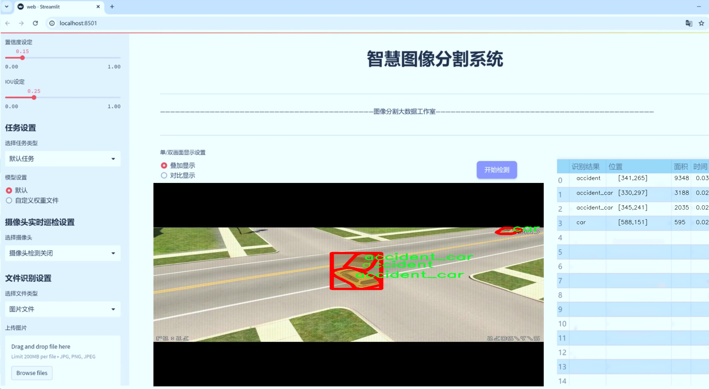
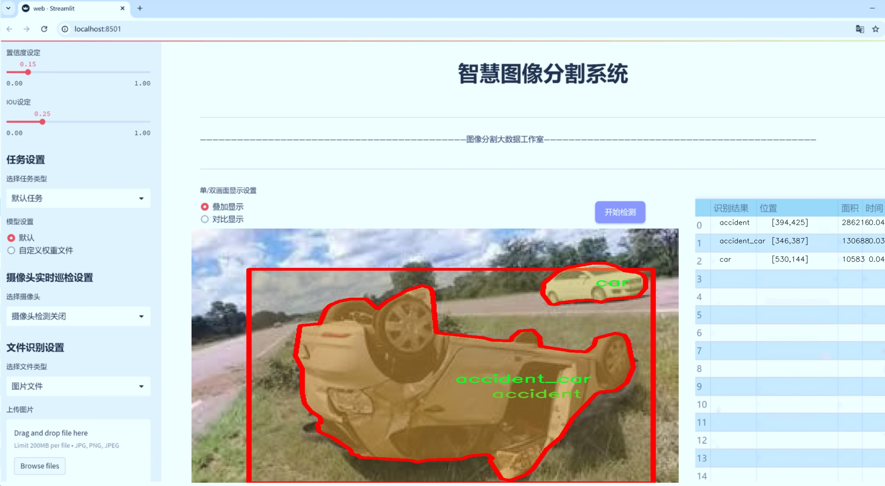
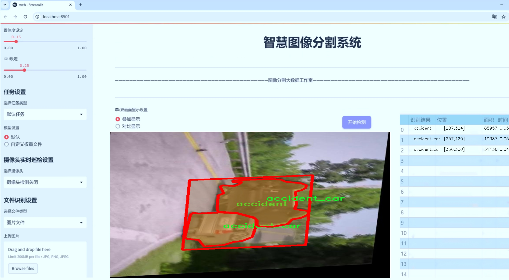
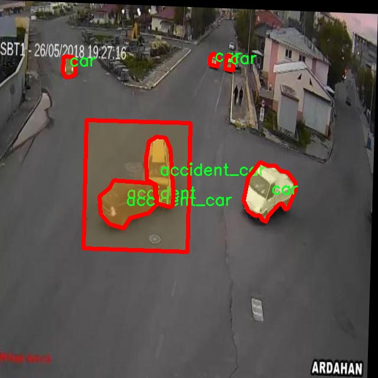
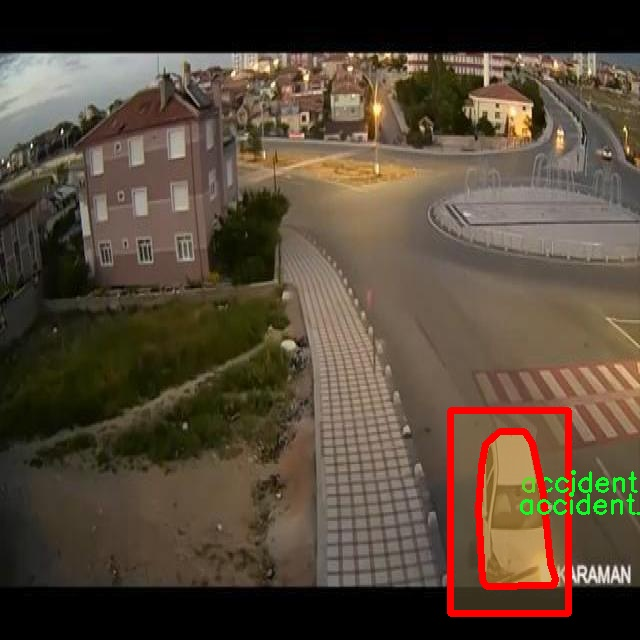
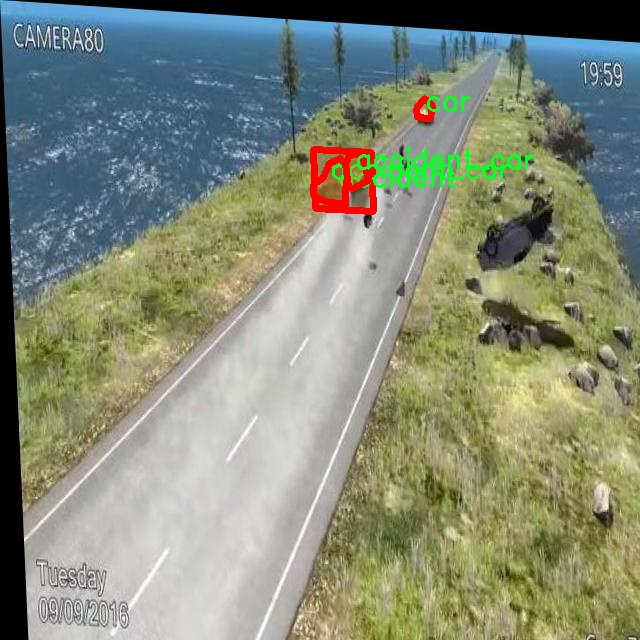
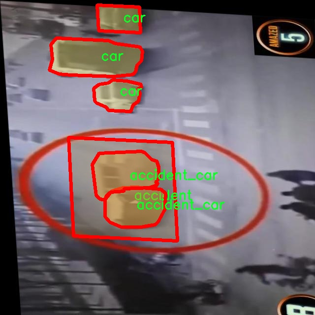
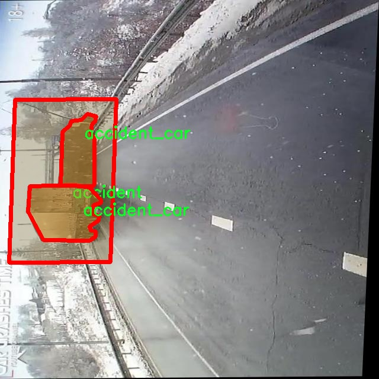

# 交通事故图像分割系统源码＆数据集分享
 [yolov8-seg-C2f-Faster＆yolov8-seg-p2等50+全套改进创新点发刊_一键训练教程_Web前端展示]

### 1.研究背景与意义

项目参考[ILSVRC ImageNet Large Scale Visual Recognition Challenge](https://gitee.com/YOLOv8_YOLOv11_Segmentation_Studio/projects)

项目来源[AAAI Global Al lnnovation Contest](https://kdocs.cn/l/cszuIiCKVNis)

研究背景与意义

随着城市化进程的加快和机动车数量的激增，交通事故的发生频率日益增加，给社会带来了巨大的经济损失和人身伤害。因此，如何有效地监测、分析和处理交通事故成为了交通管理和安全研究中的重要课题。近年来，计算机视觉技术的迅猛发展为交通事故的自动检测和分析提供了新的思路。特别是基于深度学习的图像分割技术，能够在复杂的交通场景中精准地识别和分割出不同的目标物体，从而为交通事故的快速响应和处理提供支持。

在众多的图像分割算法中，YOLO（You Only Look Once）系列模型因其高效性和实时性而备受关注。YOLOv8作为该系列的最新版本，结合了多种先进的深度学习技术，具有更强的特征提取能力和更高的分割精度。然而，尽管YOLOv8在目标检测和分割任务中表现出色，但在特定应用场景下，如交通事故图像的分割，仍然存在一定的局限性。为此，基于YOLOv8的改进版本，针对交通事故图像的特征进行优化，将有助于提升其在实际应用中的表现。

本研究旨在构建一个基于改进YOLOv8的交通事故图像分割系统，利用包含2000张图像的koren_project_riverdata数据集进行训练和验证。该数据集涵盖了三类目标：事故、事故中的车辆以及普通车辆，能够为模型提供丰富的训练样本。通过对这些图像进行深入分析，模型将能够识别和分割出事故现场的关键元素，从而为后续的事故分析和处理提供重要依据。

交通事故图像分割系统的研究不仅具有理论意义，还有着广泛的实际应用价值。首先，准确的图像分割能够帮助交通管理部门快速识别事故现场的情况，及时调度救援资源，减少事故造成的损失。其次，通过对事故图像的分析，可以为交通安全研究提供数据支持，帮助识别事故发生的高风险因素，从而为制定有效的交通安全政策提供依据。此外，该系统还可以与智能交通系统相结合，实现对交通流量的实时监控和管理，提高城市交通的安全性和效率。

综上所述，基于改进YOLOv8的交通事故图像分割系统的研究，不仅能够推动计算机视觉技术在交通领域的应用，还将为交通事故的监测与处理提供新的解决方案。通过深入探索和实践，期望能够为未来的交通安全研究和智能交通系统的建设贡献一份力量。

### 2.图片演示







##### 注意：由于此博客编辑较早，上面“2.图片演示”和“3.视频演示”展示的系统图片或者视频可能为老版本，新版本在老版本的基础上升级如下：（实际效果以升级的新版本为准）

  （1）适配了YOLOV8的“目标检测”模型和“实例分割”模型，通过加载相应的权重（.pt）文件即可自适应加载模型。

  （2）支持“图片识别”、“视频识别”、“摄像头实时识别”三种识别模式。

  （3）支持“图片识别”、“视频识别”、“摄像头实时识别”三种识别结果保存导出，解决手动导出（容易卡顿出现爆内存）存在的问题，识别完自动保存结果并导出到tempDir中。

  （4）支持Web前端系统中的标题、背景图等自定义修改，后面提供修改教程。

  另外本项目提供训练的数据集和训练教程,暂不提供权重文件（best.pt）,需要您按照教程进行训练后实现图片演示和Web前端界面演示的效果。

### 3.视频演示

[3.1 视频演示](https://www.bilibili.com/video/BV1Eyy3YUEUs/)

### 4.数据集信息展示

##### 4.1 本项目数据集详细数据（类别数＆类别名）

nc: 3
names: ['accident', 'accident_car', 'car']


##### 4.2 本项目数据集信息介绍

数据集信息展示

在本研究中，我们使用了名为“koren_project_riverdata”的数据集，以训练和改进YOLOv8-seg的交通事故图像分割系统。该数据集专注于交通事故场景的图像分析，旨在通过高效的图像分割技术，提高对交通事故的检测和识别能力。数据集包含三个主要类别，分别是“accident”、“accident_car”和“car”，这些类别的设计充分考虑了交通事故的复杂性和多样性。

首先，类别“accident”代表了交通事故的整体场景，包括事故发生时的环境、路面状况以及可能涉及的其他因素。这一类别的图像通常包含多个元素，如车辆、行人、交通标志等，具有高度的复杂性和多样性。因此，准确地识别和分割这一类别的图像对于后续的事故分析和处理至关重要。

其次，类别“accident_car”专注于事故中涉及的车辆。这一类别的图像主要包括受损车辆的特写或局部图像，强调了车辆在事故中的状态和位置。通过对这一类别的精确分割，系统能够更好地识别事故中受损的车辆，进而为事故处理和责任判定提供重要依据。

最后，类别“car”则涵盖了所有正常行驶的车辆。这一类别的存在使得系统能够区分正常交通流和事故现场的特殊情况。通过对正常车辆的识别，系统能够更全面地理解交通流量和事故发生的背景，从而为交通管理和安全措施的制定提供数据支持。

在数据集的构建过程中，图像的采集和标注是至关重要的环节。为了确保数据集的高质量和代表性，研究团队采用了多种来源的图像，包括监控摄像头捕捉的实时交通场景、交通事故现场的照片以及经过专业人士标注的图像。这些图像不仅涵盖了不同时间、不同地点的交通事故场景，还考虑了不同天气条件和光照环境对图像质量的影响。

此外，为了增强模型的鲁棒性和泛化能力，数据集还进行了多种数据增强处理，如旋转、缩放、翻转等。这些处理不仅丰富了数据集的多样性，还帮助模型在面对不同场景时能够保持良好的性能表现。

在训练过程中，YOLOv8-seg模型将利用这一数据集进行深度学习，通过不断迭代优化模型参数，以提高对交通事故图像的分割精度。数据集的多样性和复杂性将为模型提供丰富的训练样本，使其能够在实际应用中更准确地识别和分割交通事故相关的图像信息。

综上所述，“koren_project_riverdata”数据集为改进YOLOv8-seg的交通事故图像分割系统提供了坚实的基础。通过对事故场景的深入分析和多样化的图像数据，研究团队希望能够实现更高效的交通事故检测和处理，为交通安全和管理提供有力支持。











### 5.全套项目环境部署视频教程（零基础手把手教学）

[5.1 环境部署教程链接（零基础手把手教学）](https://www.bilibili.com/video/BV1jG4Ve4E9t/?vd_source=bc9aec86d164b67a7004b996143742dc)


[5.2 安装Python虚拟环境创建和依赖库安装视频教程链接（零基础手把手教学）](https://www.bilibili.com/video/BV1nA4VeYEze/?vd_source=bc9aec86d164b67a7004b996143742dc)

### 6.手把手YOLOV8-seg训练视频教程（零基础小白有手就能学会）

[6.1 手把手YOLOV8-seg训练视频教程（零基础小白有手就能学会）](https://www.bilibili.com/video/BV1cA4VeYETe/?vd_source=bc9aec86d164b67a7004b996143742dc)


按照上面的训练视频教程链接加载项目提供的数据集，运行train.py即可开始训练



     Epoch   gpu_mem       box       obj       cls    labels  img_size
     1/200     0G   0.01576   0.01955  0.007536        22      1280: 100%|██████████| 849/849 [14:42<00:00,  1.04s/it]
               Class     Images     Labels          P          R     mAP@.5 mAP@.5:.95: 100%|██████████| 213/213 [01:14<00:00,  2.87it/s]
                 all       3395      17314      0.994      0.957      0.0957      0.0843

     Epoch   gpu_mem       box       obj       cls    labels  img_size
     2/200     0G   0.01578   0.01923  0.007006        22      1280: 100%|██████████| 849/849 [14:44<00:00,  1.04s/it]
               Class     Images     Labels          P          R     mAP@.5 mAP@.5:.95: 100%|██████████| 213/213 [01:12<00:00,  2.95it/s]
                 all       3395      17314      0.996      0.956      0.0957      0.0845

     Epoch   gpu_mem       box       obj       cls    labels  img_size
     3/200     0G   0.01561    0.0191  0.006895        27      1280: 100%|██████████| 849/849 [10:56<00:00,  1.29it/s]
               Class     Images     Labels          P          R     mAP@.5 mAP@.5:.95: 100%|███████   | 187/213 [00:52<00:00,  4.04it/s]
                 all       3395      17314      0.996      0.957      0.0957      0.0845


### 7.50+种全套YOLOV8-seg创新点代码加载调参视频教程（一键加载写好的改进模型的配置文件）

[7.1 50+种全套YOLOV8-seg创新点代码加载调参视频教程（一键加载写好的改进模型的配置文件）](https://www.bilibili.com/video/BV1Hw4VePEXv/?vd_source=bc9aec86d164b67a7004b996143742dc)

### 8.YOLOV8-seg图像分割算法原理

原始YOLOv8-seg算法原理

YOLOv8-seg算法是2023年由Ultralytics推出的一款全新目标检测与分割模型，承载着YOLO系列算法的创新与发展。它不仅继承了YOLOv3、YOLOv5等前辈的设计理念，还融合了YOLOX、YOLOv6、YOLOv7和PPYOLOE等算法的优点，尤其在Head标签分配和Loss部分的设计上，YOLOv8-seg展现出了极高的灵活性与准确性。通过这些改进，YOLOv8-seg在实时检测领域达到了一个新的高度，具备了高精度和快速处理的双重优势，极大地推动了目标检测技术的进步。

YOLOv8-seg的核心在于其高效的网络结构和先进的损失函数设计。首先，在数据预处理阶段，YOLOv8-seg依然采用了YOLOv5的策略，结合了马赛克增强、混合增强、空间扰动和颜色扰动等多种数据增强手段。这些增强技术的引入，使得模型在训练过程中能够接触到更为丰富的样本变换，提升了模型的泛化能力和鲁棒性。

在骨干网络结构方面，YOLOv8-seg的设计灵感来源于YOLOv5，但在此基础上进行了创新。YOLOv8-seg将YOLOv5中的C3模块替换为新的C2f模块，C2f模块通过引入更多的分支，增强了梯度回传过程中的信息流动，确保了特征提取的多样性与准确性。这种设计不仅提高了模型的性能，还在一定程度上降低了计算复杂度，使得YOLOv8-seg在处理大规模数据时表现得更加高效。

YOLOv8-seg的特征金字塔网络（FPN）和路径聚合网络（PAN）结构同样值得关注。该结构通过多尺度信息的融合，确保了不同尺度特征的有效利用。YOLOv8-seg在FPN-PAN结构中，依然保留了YOLOv5的设计思路，但在C3模块的替换上进行了优化，使得网络在特征融合时能够更好地捕捉到目标物体的细节信息。这种多尺度特征的融合能力，使得YOLOv8-seg在处理复杂场景时，能够有效提升目标检测的准确性。

在检测头的设计上，YOLOv8-seg采用了解耦头（Decoupled Head）结构，这一结构的创新使得分类和定位任务可以并行进行，分别提取类别特征和位置特征。通过这种方式，YOLOv8-seg能够更好地处理目标检测中的复杂性，提高了模型的整体性能。此外，YOLOv8-seg在标签分配策略上采用了TOOD策略，这种动态标签分配方法能够有效解决正负样本匹配的问题，使得模型在训练过程中更加高效。

在损失函数的设计上，YOLOv8-seg引入了Varifocal Loss（VFL）和CIoU Loss与DFL Loss的组合。这种损失函数的设计理念在于，通过对正负样本进行加权，使得模型能够更好地聚焦于高质量的样本，从而提升检测精度。具体而言，VFL通过不对称参数对正负样本进行加权，确保模型在训练时能够更加关注那些具有较高GTIoU的正样本，同时降低负样本对损失的影响。这种设计使得YOLOv8-seg在训练过程中，能够有效提升AP（Average Precision）指标，进而提高模型的整体性能。

值得一提的是，YOLOv8-seg在Anchor的使用上进行了重大变革，采用了Anchor-Free的方法。这一创新不仅简化了模型的结构，还提升了模型的泛化能力。传统的Anchor-Based方法需要预设多个Anchor框，并进行IoU计算，这在处理不同尺寸和比例的目标时显得不够灵活。而YOLOv8-seg通过将目标检测转化为关键点检测，消除了对Anchor的依赖，使得模型在面对复杂场景时能够更加高效地进行目标检测。

总的来说，YOLOv8-seg算法在多个方面进行了创新与优化，从数据预处理到网络结构设计，再到损失函数的设计，都展现出了其在目标检测领域的强大能力。通过引入新的模块和设计理念，YOLOv8-seg不仅提升了检测精度和速度，还为目标检测和图像分割任务提供了更加灵活和高效的解决方案。随着YOLOv8-seg的推广与应用，未来在自动化采摘、智能监控等领域的应用前景将更加广阔。


### 9.系统功能展示（检测对象为举例，实际内容以本项目数据集为准）

图9.1.系统支持检测结果表格显示

  图9.2.系统支持置信度和IOU阈值手动调节

  图9.3.系统支持自定义加载权重文件best.pt(需要你通过步骤5中训练获得)

  图9.4.系统支持摄像头实时识别

  图9.5.系统支持图片识别

  图9.6.系统支持视频识别

  图9.7.系统支持识别结果文件自动保存

  图9.8.系统支持Excel导出检测结果数据


### 10.50+种全套YOLOV8-seg创新点原理讲解（非科班也可以轻松写刊发刊，V11版本正在科研待更新）

#### 10.1 由于篇幅限制，每个创新点的具体原理讲解就不一一展开，具体见下列网址中的创新点对应子项目的技术原理博客网址【Blog】：


[10.1 50+种全套YOLOV8-seg创新点原理讲解链接](https://gitee.com/qunmasj/good)

#### 10.2 部分改进模块原理讲解(完整的改进原理见上图和技术博客链接)【如果此小节的图加载失败可以通过CSDN或者Github搜索该博客的标题访问原始博客，原始博客图片显示正常】
### 深度学习基础
卷积神经网络通过使用具有共享参数的卷积运算显著降低了模型的计算开销和复杂性。在LeNet、AlexNet和VGG等经典网络的驱动下，卷积神经网络现在已经建立了一个完整的系统，并在深度学习领域形成了先进的卷积神经网络模型。

感受野注意力卷积RFCBAMConv的作者在仔细研究了卷积运算之后获得了灵感。对于分类、目标检测和语义分割任务，一方面，图像中不同位置的对象的形状、大小、颜色和分布是可变的。在卷积操作期间，卷积核在每个感受野中使用相同的参数来提取信息，而不考虑来自不同位置的差分信息。这限制了网络的性能，这已经在最近的许多工作中得到了证实。

另一方面，卷积运算没有考虑每个特征的重要性，这进一步影响了提取特征的有效性，并最终限制了模型的性能。此外，注意力机制允许模型专注于重要特征，这可以增强特征提取的优势和卷积神经网络捕获详细特征信息的能力。因此，注意力机制在深度学习中得到了广泛的应用，并成功地应用于各个领域。

通过研究卷积运算的内在缺陷和注意力机制的特点，作者认为现有的空间注意力机制从本质上解决了卷积运算的参数共享问题，但仍局限于对空间特征的认知。对于较大的卷积核，现有的空间注意力机制并没有完全解决共享参数的问题。此外，他们无法强调感受野中每个特征的重要性，例如现有的卷积块注意力模块（CBAM）和 Coordinate注意力（CA）。

因此，[参考该博客提出了一种新的感受野注意力机制（RFA）](https://qunmasj.com)，它完全解决了卷积核共享参数的问题，并充分考虑了感受野中每个特征的重要性。通过RFA设计的卷积运算（RFAConv）是一种新的卷积运算，可以取代现有神经网络中的标准卷积运算。RFAConv通过添加一些参数和计算开销来提高网络性能。

大量关于Imagnet-1k、MS COCO和VOC的实验已经证明了RFAConv的有效性。作为一种由注意力构建的新型卷积运算，它超过了由CAM、CBAM和CA构建的卷积运算（CAMConv、CBAMConv、CAConv）以及标准卷积运算。

此外，为了解决现有方法提取感受野特征速度慢的问题，提出了一种轻量级操作。在构建RFAConv的过程中，再次设计了CA和CBAM的升级版本，并进行了相关实验。作者认为当前的空间注意力机制应该将注意力放在感受野空间特征上，以促进当前空间注意力机制的发展，并再次增强卷积神经网络架构的优势。


### 卷积神经网络架构
出色的神经网络架构可以提高不同任务的性能。卷积运算作为卷积神经网络的一种基本运算，推动了人工智能的发展，并为车辆检测、无人机图像、医学等先进的网络模型做出了贡献。He等人认为随着网络深度的增加，该模型将变得难以训练并产生退化现象，因此他们提出了残差连接来创新卷积神经网络架构的设计。Huang等人通过重用特征来解决网络梯度消失问题，增强了特征信息，他们再次创新了卷积神经网络架构。

通过对卷积运算的详细研究，Dai等人认为，具有固定采样位置的卷积运算在一定程度上限制了网络的性能，因此提出了Deformable Conv，通过学习偏移来改变卷积核的采样位置。在Deformable Conv的基础上，再次提出了Deformable Conv V2和Deformable Conv V3，以提高卷积网络的性能。

Zhang等人注意到，组卷积可以减少模型的参数数量和计算开销。然而，少于组内信息的交互将影响最终的网络性能。1×1的卷积可以与信息相互作用。然而，这将带来更多的参数和计算开销，因此他们提出了无参数的“通道Shuffle”操作来与组之间的信息交互。

Ma等人通过实验得出结论，对于参数较少的模型，推理速度不一定更快，对于计算量较小的模型，推理也不一定更快。经过仔细研究提出了Shufflenet V2。

YOLO将输入图像划分为网格，以预测对象的位置和类别。经过不断的研究，已经提出了8个版本的基于YOLO的目标检测器，如YOLOv5、YOLOv7、YOLOv8等。上述卷积神经网络架构已经取得了巨大的成功。然而，它们并没有解决提取特征过程中的参数共享问题。本文的工作从注意力机制开始，从一个新的角度解决卷积参数共享问题。

### 注意力机制
注意力机制被用作一种提高网络模型性能的技术，使其能够专注于关键特性。注意力机制理论已经在深度学习中建立了一个完整而成熟的体系。Hu等人提出了一种Squeeze-and-Excitation（SE）块，通过压缩特征来聚合全局通道信息，从而获得与每个通道对应的权重。Wang等人认为，当SE与信息交互时，单个通道和权重之间的对应关系是间接的，因此设计了高效通道注Efficient Channel Attention力（ECA），并用自适应kernel大小的一维卷积取代了SE中的全连接（FC）层。Woo等人提出了卷积块注意力模块（CBAM），它结合了通道注意力和空间注意力。作为一个即插即用模块，它可以嵌入卷积神经网络中，以提高网络性能。

尽管SE和CBAM已经提高了网络的性能。Hou等人仍然发现压缩特征在SE和CBAM中丢失了太多信息。因此，他们提出了轻量级Coordinate注意力（CA）来解决SE和CBAM中的问题。Fu等人计了一个空间注意力模块和通道注意力模块，用于扩展全卷积网络（FCN），分别对空间维度和通道维度的语义相关性进行建模。Zhang等人在通道上生成不同尺度的特征图，以建立更有效的通道注意力机制。

本文从一个新的角度解决了标准卷积运算的参数共享问题。这就是将注意力机制结合起来构造卷积运算。尽管目前的注意力机制已经获得了良好的性能，但它们仍然没有关注感受野的空间特征。因此，设计了具有非共享参数的RFA卷积运算，以提高网络的性能。


#### 回顾标准卷积
以标准卷积运算为基础构建卷积神经网络，通过共享参数的滑动窗口提取特征信息，解决了全连接层构建的神经网络的固有问题（即参数数量大、计算开销高）。

设表示输入特征图，其中、和分别表示特征图的通道数、高度和宽度。为了能够清楚地展示卷积核提取特征信息的过程，以为例。提取每个感受野slider的特征信息的卷积运算可以表示如下：


这里，表示在每次卷积slider操作之后获得的值，表示在每个slider内的相应位置处的像素值。表示卷积核，表示卷积核中的参数数量，表示感受野slider的总数。

可以看出，每个slider内相同位置的特征共享相同的参数。因此，标准的卷积运算无法感知不同位置带来的差异信息，这在一定程度上限制了卷积神经网络的性能。

#### 回顾空间注意力
目前，空间注意力机制使用通过学习获得的注意力图来突出每个特征的重要性。与上一节类似，以为例。突出关键特征的空间注意力机制可以简单地表达如下：


这里，表示在加权运算之后获得的值。和分别表示输入特征图和学习注意力图在不同位置的值，是输入特征图的高度和宽度的乘积，表示像素值的总数。一般来说，整个过程可以简单地表示在图1中。


#### 空间注意力与标准卷积
众所周知，将注意力机制引入卷积神经网络可以提高网络的性能。通过标准的卷积运算和对现有空间注意力机制的仔细分析。作者认为空间注意力机制本质上解决了卷积神经网络的固有缺点，即共享参数的问题。

目前，该模型最常见的卷积核大小为1×1和3×3。引入空间注意力机制后用于提取特征的卷积操作是1×1或3×3卷积操作。这个过程可以直观地显示出来。空间注意力机制被插入到1×1卷积运算的前面。通过注意力图对输入特征图进行加权运算（Re-weight“×”），最后通过1×1卷积运算提取感受野的slider特征信息。

整个过程可以简单地表示如下：


 

这里，卷积核仅表示一个参数值。如果将的值作为一个新的卷积核参数，那么有趣的是，通过1×1卷积运算提取特征时的参数共享问题得到了解决。然而，空间注意力机制的传说到此结束。当空间注意力机制被插入到3×3卷积运算的前面时。具体情况如下：


如上所述，如果取的值。作为一种新的卷积核参数，上述方程完全解决了大规模卷积核的参数共享问题。然而，最重要的一点是，卷积核在每个感受野slider中提取将共享部分特征的特征。换句话说，在每个感受野slider内都会有重叠。

经过仔细分析发现，，…，空间注意力图的权重在每个slider内共享。因此，空间注意机制不能解决大规模卷积核共享参数的问题，因为它们不注意感受野的空间特征。在这种情况下，空间注意力机制是有限的。
#### 创新空间注意力与标准卷积
RFA是为了解决空间注意力机制问题而提出的，创新了空间注意力。使用与RFA相同的思想，一系列空间注意力机制可以再次提高性能。RFA设计的卷积运算可以被视为一种轻量级的即插即用模块，以取代标准卷积，从而提高卷积神经网络的性能。因此，作者认为空间注意力机制和标准卷积在未来将有一个新的春天。

感受野的空间特征：

现在给出感受野空间特征的定义。它是专门为卷积核设计的，并根据kernel大小动态生成，如图2所示，以3×3卷积核为例。


在图2中，“空间特征”表示原始特征图，等于空间特征。“感受野空间特征”表示变换后的特征，该特征由每个感受野slider滑块组成，并且不重叠。也就是说，“感受野空间特征”中的每个3×3大小的slider表示提取原始3×3卷积特征时所有感觉野slider的特征。

#### 感受野注意力卷积(RFA):

关于感受野空间特征，该博客的作者提出了感受野注意（RFA），它不仅强调了感受野slider内各种特征的重要性，而且还关注感受野空间特性，以彻底解决卷积核参数共享的问题。感受野空间特征是根据卷积核的大小动态生成的，因此，RFA是卷积的固定组合，不能脱离卷积运算的帮助，卷积运算同时依赖RFA来提高性能。

因此，作者提出了感受野注意力卷积（RFAConv）。具有3×3大小卷积核的RFAConv的总体结构如图3所示。


目前，提取感受野特征最常用的方法速度较慢，因此经过不断探索提出了一种快速的方法，通过分组卷积来取代原来的方法。

具体来说，根据感受野大小，使用相应的组卷积大小来动态生成展开特征。尽管与原始的无参数方法（如Pytorch提供的nn.Unfld()）相比，该方法添加了一些参数，但速度要快得多。

注意：正如在上一节中提到的，当原始的3×3卷积核提取特征时，感受野空间特征中的每个3×3大小的窗口表示所有感受野滑块的特征。但在快速分组卷积提取感受野特征后，由于原始方法太慢，它们会被映射到新的特征中。

最近的一些工作已经证明信息交互可以提高网络性能。类似地，对于RFAConv，与感受野特征信息交互以学习注意力图可以提高网络性能，但与每个感受野特征交互将带来额外的计算开销。为了确保少量的计算开销和参数数量，通过探索使用AvgPool池化每个感受野特征的全局信息，然后通过1×1组卷积运算与信息交互。最后，softmax用于强调感受野特征中每个特征的重要性。通常，RFA的计算可以表示为：


表示分组卷积，表示卷积核的大小，代表规范化，表示输入特征图，是通过将注意力图与变换的感受野空间特征相乘而获得的。

与CBAM和CA不同，RFA可以为每个感受野特征生成注意力图。标准卷积受到卷积神经网络性能的限制，因为共享参数的卷积运算对位置带来的差异信息不敏感。RFA完全可以解决这个问题，具体细节如下：


由于RFA获得的特征图是“调整形状”后不重叠的感受野空间特征，因此通过池化每个感受野滑块的特征信息来学习学习的注意力图。换句话说，RFA学习的注意力图不再在每个感受野slider内共享，并且是有效的。这完全解决了现有的CA和CBAM对大尺寸kernel的注意力机制中的参数共享问题。

同时，RFA给标准卷积核带来了相当大的好处，但调整形状后，特征的高度和宽度是k倍，需要进行k×k的stride卷积运算，才能提取特征信息。RFAConv创新了标准卷积运算。

此外，空间注意力机制将得到升级，因为作者认为现有的空间注意力机制应该专注于感受野空间特征，以提高网络的性能。众所周知，基于自注意力机制的网络模型取得了巨大的成功，因为它解决了卷积参数共享的问题，并对远程信息进行了建模，但基于自注意力机理的方法给模型带来了巨大的计算开销和复杂性。作者认为通过将一些现有空间注意力机制的注意力放在感受野空间特征中，它以轻量级的方式解决了自注意力机制的问题。

答案如下：

将关注感受野空间特征的空间注意力与卷积相匹配，完全解决了卷积参数共享的问题；

当前的空间注意力机制本身具有考虑远距离信息的特点，它们通过全局平均池化或全局最大池化来获得全局信息，这在一定程度上考虑了远距离信息。


为此，作者设计了一种新的CBAM和CA，称为RFACBAM和RFACA，它专注于感受野的空间特征。与RFA类似，使用stride为k的k×k的最终卷积运算来提取特征信息，具体结构如图4和图5所示，将这2种新的卷积方法称为RFCBAMConv和RFCAConv。比较原始的CBAM，使用SE注意力来代替RFCBAM中的CAM。因为这样可以减少计算开销。


此外，在RFCBAM中，通道和空间注意力不是在单独的步骤中执行的，因为通道和空间注意力是同时加权的，从而允许在每个通道上获得的注意力图是不同的。


### 11.项目核心源码讲解（再也不用担心看不懂代码逻辑）

#### 11.1 ultralytics\nn\extra_modules\ops_dcnv3\functions\__init__.py

以下是对给定代码的核心部分进行分析和详细注释的结果：

```python
# --------------------------------------------------------
# InternImage
# Copyright (c) 2022 OpenGVLab
# Licensed under The MIT License [see LICENSE for details]
# --------------------------------------------------------

# 从当前包中导入DCNv3Function和dcnv3_core_pytorch模块
from .dcnv3_func import DCNv3Function, dcnv3_core_pytorch

# DCNv3Function: 这是一个自定义的函数类，可能实现了某种深度学习中的变换或操作。
# dcnv3_core_pytorch: 这个模块可能包含了与DCNv3相关的核心功能，使用PyTorch框架实现。
```

### 注释说明：
1. **版权信息**：开头的版权信息说明了代码的来源和使用许可，确保遵循MIT许可证的相关条款。
2. **模块导入**：使用相对导入的方式引入`dcnv3_func`模块中的`DCNv3Function`和`dcnv3_core_pytorch`。这种方式通常用于在同一包内组织代码，使得模块之间的依赖关系更加清晰。
3. **功能说明**：虽然具体的实现细节没有给出，但可以推测这两个导入的内容与深度学习中的某种变换或操作有关，可能是用于图像处理或计算机视觉任务的。

这个代码片段的核心在于它的模块导入部分，后续的功能实现可能会依赖于这些导入的内容。

这个文件是一个Python模块的初始化文件，位于`ultralytics/nn/extra_modules/ops_dcnv3/functions/`目录下。文件的开头包含了一些版权信息，表明该代码是由OpenGVLab于2022年开发的，并且使用MIT许可证进行授权，这意味着该代码可以自由使用和修改，但需要遵循相应的许可证条款。

在文件的主体部分，代码通过`from`语句导入了两个对象：`DCNv3Function`和`dcnv3_core_pytorch`。这两个对象来自于同一目录下的`dcnv3_func`模块。通过这种方式，其他模块在导入这个包时，可以直接使用这两个对象，而不需要再指定具体的模块名称。

`DCNv3Function`可能是一个实现了某种深度学习操作的类或函数，而`dcnv3_core_pytorch`则可能是与PyTorch框架相关的核心功能或实现。这种设计通常用于将复杂的功能模块化，使得代码结构更加清晰，便于维护和使用。

总的来说，这个文件的主要作用是将`dcnv3_func`模块中的特定功能暴露给外部，方便其他部分的代码进行调用。

#### 11.2 ui.py

```python
import sys
import subprocess

def run_script(script_path):
    """
    使用当前 Python 环境运行指定的脚本。

    Args:
        script_path (str): 要运行的脚本路径

    Returns:
        None
    """
    # 获取当前 Python 解释器的路径
    python_path = sys.executable

    # 构建运行命令
    command = f'"{python_path}" -m streamlit run "{script_path}"'

    # 执行命令
    result = subprocess.run(command, shell=True)
    if result.returncode != 0:
        print("脚本运行出错。")


# 实例化并运行应用
if __name__ == "__main__":
    # 指定您的脚本路径
    script_path = "web.py"  # 这里直接指定脚本路径

    # 运行脚本
    run_script(script_path)
```

### 代码注释说明：

1. **导入模块**：
   - `import sys`：导入系统相关的模块，用于获取当前 Python 解释器的路径。
   - `import subprocess`：导入子进程模块，用于在 Python 中执行外部命令。

2. **定义函数 `run_script`**：
   - 函数接受一个参数 `script_path`，表示要运行的 Python 脚本的路径。
   - 函数内部首先获取当前 Python 解释器的路径 `python_path`，以便后续使用。

3. **构建命令**：
   - 使用 f-string 格式化字符串构建命令，命令的格式为：`"{python_path}" -m streamlit run "{script_path}"`，这表示使用当前 Python 解释器运行 `streamlit` 模块并执行指定的脚本。

4. **执行命令**：
   - 使用 `subprocess.run` 执行构建好的命令，`shell=True` 表示在 shell 中执行命令。
   - 检查命令执行的返回码 `result.returncode`，如果不为 0，表示脚本运行出错，打印错误信息。

5. **主程序入口**：
   - `if __name__ == "__main__":` 确保只有在直接运行该脚本时才会执行以下代码。
   - 指定要运行的脚本路径 `script_path`，这里直接指定为 `"web.py"`。
   - 调用 `run_script` 函数，传入脚本路径以运行该脚本。

这个程序文件的主要功能是使用当前的 Python 环境来运行一个指定的脚本，具体来说是一个名为 `web.py` 的脚本。程序首先导入了必要的模块，包括 `sys`、`os` 和 `subprocess`，这些模块分别用于获取系统信息、处理文件路径和执行外部命令。

在 `run_script` 函数中，首先获取当前 Python 解释器的路径，这样可以确保使用正确的 Python 环境来运行脚本。接着，构建一个命令字符串，该命令使用 `streamlit` 模块来运行指定的脚本。`streamlit` 是一个用于构建数据应用的库，这里通过 `-m` 参数来指定模块的运行方式。

随后，使用 `subprocess.run` 方法执行构建好的命令。这个方法会在新的 shell 中运行命令，并等待其完成。如果脚本运行过程中出现错误，返回的 `returncode` 将不为零，程序会打印出“脚本运行出错”的提示信息。

在文件的最后部分，使用 `if __name__ == "__main__":` 语句来确保只有在直接运行该文件时才会执行下面的代码。这部分代码指定了要运行的脚本路径，调用 `abs_path` 函数获取该路径的绝对路径，并最终调用 `run_script` 函数来执行这个脚本。

总体而言，这个程序是一个简单的脚本启动器，专门用于运行一个名为 `web.py` 的 Streamlit 应用，确保使用当前的 Python 环境，并处理可能出现的错误。

#### 11.3 ultralytics\nn\__init__.py

```python
# 导入所需的模型和工具函数
from .tasks import (BaseModel, ClassificationModel, DetectionModel, SegmentationModel, 
                    attempt_load_one_weight, attempt_load_weights, guess_model_scale, 
                    guess_model_task, parse_model, torch_safe_load, yaml_model_load)

# 定义模块的公开接口，包含可以被外部访问的函数和类
__all__ = ('attempt_load_one_weight', 'attempt_load_weights', 'parse_model', 'yaml_model_load', 
           'guess_model_task', 'guess_model_scale', 'torch_safe_load', 
           'DetectionModel', 'SegmentationModel', 'ClassificationModel', 'BaseModel')
```

### 代码注释说明：
1. **导入模块**：
   - 从`.tasks`模块中导入了多个类和函数，这些类和函数是实现模型加载、解析和推理的核心功能。
   - `BaseModel`、`ClassificationModel`、`DetectionModel`、`SegmentationModel`是不同类型的模型类，分别用于基础模型、分类、检测和分割任务。
   - `attempt_load_one_weight`和`attempt_load_weights`用于加载模型权重。
   - `guess_model_scale`和`guess_model_task`用于推测模型的规模和任务类型。
   - `parse_model`用于解析模型结构。
   - `torch_safe_load`和`yaml_model_load`用于安全地加载PyTorch模型和YAML配置文件。

2. **定义公开接口**：
   - `__all__`是一个特殊变量，定义了当使用`from module import *`时，哪些名称会被导入。这里列出了所有希望公开的函数和类，确保模块的使用者能够方便地访问这些核心功能。

这个程序文件是Ultralytics YOLO（You Only Look Once）项目的一部分，主要用于模型的定义和加载。文件开头包含了一个许可证声明，表明该代码遵循AGPL-3.0许可证，这意味着用户可以自由使用、修改和分发代码，但需要遵循相应的开源协议。

接下来，文件通过相对导入的方式引入了多个类和函数，这些类和函数主要来自于同一包内的`tasks`模块。具体来说，这里导入了四个模型类：`BaseModel`、`ClassificationModel`、`DetectionModel`和`SegmentationModel`，它们分别代表基础模型、分类模型、检测模型和分割模型。这些模型类可能用于不同的计算机视觉任务。

此外，文件还导入了一些辅助函数，包括`attempt_load_one_weight`、`attempt_load_weights`、`guess_model_scale`、`guess_model_task`、`parse_model`、`torch_safe_load`和`yaml_model_load`。这些函数的功能可能涉及到模型权重的加载、模型任务的推测、模型解析以及从YAML文件中加载模型配置等。

最后，`__all__`变量定义了一个公共接口，列出了可以被外部导入的类和函数。这意味着，当用户使用`from ultralytics.nn import *`这样的语句时，只会导入`__all__`中列出的内容，从而控制了模块的公开API，避免不必要的内部实现细节暴露给用户。

总体而言，这个文件的主要作用是组织和管理与YOLO模型相关的类和函数，为后续的模型训练和推理提供基础。

#### 11.4 ultralytics\trackers\utils\matching.py

以下是经过简化和注释的核心代码部分：

```python
import numpy as np
import scipy
from scipy.spatial.distance import cdist
from ultralytics.utils.metrics import bbox_ioa

try:
    import lap  # 导入线性分配库
    assert lap.__version__  # 确保导入的包是有效的
except (ImportError, AssertionError, AttributeError):
    from ultralytics.utils.checks import check_requirements
    check_requirements('lapx>=0.5.2')  # 检查并安装lapx库
    import lap

def linear_assignment(cost_matrix, thresh, use_lap=True):
    """
    使用线性分配算法进行匹配。

    参数:
        cost_matrix (np.ndarray): 成本矩阵，包含分配的成本值。
        thresh (float): 认为分配有效的阈值。
        use_lap (bool, optional): 是否使用lap.lapjv算法。默认为True。

    返回:
        (tuple): 包含匹配索引、未匹配的索引（来自'a'）和未匹配的索引（来自'b'）的元组。
    """
    if cost_matrix.size == 0:
        # 如果成本矩阵为空，返回空匹配和所有未匹配索引
        return np.empty((0, 2), dtype=int), tuple(range(cost_matrix.shape[0])), tuple(range(cost_matrix.shape[1]))

    if use_lap:
        # 使用lap库进行线性分配
        _, x, y = lap.lapjv(cost_matrix, extend_cost=True, cost_limit=thresh)
        matches = [[ix, mx] for ix, mx in enumerate(x) if mx >= 0]  # 生成匹配对
        unmatched_a = np.where(x < 0)[0]  # 找到未匹配的'a'索引
        unmatched_b = np.where(y < 0)[0]  # 找到未匹配的'b'索引
    else:
        # 使用scipy进行线性分配
        x, y = scipy.optimize.linear_sum_assignment(cost_matrix)  # 获取匹配的行和列索引
        matches = np.asarray([[x[i], y[i]] for i in range(len(x)) if cost_matrix[x[i], y[i]] <= thresh])
        if len(matches) == 0:
            unmatched_a = list(np.arange(cost_matrix.shape[0]))  # 所有'a'索引未匹配
            unmatched_b = list(np.arange(cost_matrix.shape[1]))  # 所有'b'索引未匹配
        else:
            unmatched_a = list(set(np.arange(cost_matrix.shape[0])) - set(matches[:, 0]))  # 找到未匹配的'a'索引
            unmatched_b = list(set(np.arange(cost_matrix.shape[1])) - set(matches[:, 1]))  # 找到未匹配的'b'索引

    return matches, unmatched_a, unmatched_b  # 返回匹配和未匹配的索引

def iou_distance(atracks, btracks):
    """
    基于交并比（IoU）计算轨迹之间的成本。

    参数:
        atracks (list[STrack] | list[np.ndarray]): 轨迹'a'或边界框的列表。
        btracks (list[STrack] | list[np.ndarray]): 轨迹'b'或边界框的列表。

    返回:
        (np.ndarray): 基于IoU计算的成本矩阵。
    """
    # 如果输入是边界框，直接使用
    if (len(atracks) > 0 and isinstance(atracks[0], np.ndarray)) \
            or (len(btracks) > 0 and isinstance(btracks[0], np.ndarray)):
        atlbrs = atracks
        btlbrs = btracks
    else:
        # 否则提取边界框
        atlbrs = [track.tlbr for track in atracks]
        btlbrs = [track.tlbr for track in btracks]

    ious = np.zeros((len(atlbrs), len(btlbrs)), dtype=np.float32)  # 初始化IoU矩阵
    if len(atlbrs) and len(btlbrs):
        # 计算IoU
        ious = bbox_ioa(np.ascontiguousarray(atlbrs, dtype=np.float32),
                        np.ascontiguousarray(btlbrs, dtype=np.float32),
                        iou=True)
    return 1 - ious  # 返回成本矩阵（1 - IoU）

def embedding_distance(tracks, detections, metric='cosine'):
    """
    基于嵌入计算轨迹和检测之间的距离。

    参数:
        tracks (list[STrack]): 轨迹列表。
        detections (list[BaseTrack]): 检测列表。
        metric (str, optional): 距离计算的度量。默认为'cosine'。

    返回:
        (np.ndarray): 基于嵌入计算的成本矩阵。
    """
    cost_matrix = np.zeros((len(tracks), len(detections)), dtype=np.float32)  # 初始化成本矩阵
    if cost_matrix.size == 0:
        return cost_matrix  # 如果成本矩阵为空，直接返回

    det_features = np.asarray([track.curr_feat for track in detections], dtype=np.float32)  # 获取检测特征
    track_features = np.asarray([track.smooth_feat for track in tracks], dtype=np.float32)  # 获取轨迹特征
    cost_matrix = np.maximum(0.0, cdist(track_features, det_features, metric))  # 计算距离并确保非负
    return cost_matrix  # 返回成本矩阵

def fuse_score(cost_matrix, detections):
    """
    将成本矩阵与检测分数融合，生成单一相似度矩阵。

    参数:
        cost_matrix (np.ndarray): 包含分配成本值的矩阵。
        detections (list[BaseTrack]): 带有分数的检测列表。

    返回:
        (np.ndarray): 融合后的相似度矩阵。
    """
    if cost_matrix.size == 0:
        return cost_matrix  # 如果成本矩阵为空，直接返回

    iou_sim = 1 - cost_matrix  # 计算IoU相似度
    det_scores = np.array([det.score for det in detections])  # 获取检测分数
    det_scores = np.expand_dims(det_scores, axis=0).repeat(cost_matrix.shape[0], axis=0)  # 扩展分数维度
    fuse_sim = iou_sim * det_scores  # 融合相似度
    return 1 - fuse_sim  # 返回融合后的成本
```

### 代码说明：
1. **linear_assignment**：实现线性分配算法，根据成本矩阵进行匹配，返回匹配的索引和未匹配的索引。
2. **iou_distance**：计算轨迹之间的IoU（交并比），并返回成本矩阵。
3. **embedding_distance**：计算轨迹和检测之间的距离，基于特征嵌入生成成本矩阵。
4. **fuse_score**：将成本矩阵与检测分数结合，生成一个相似度矩阵，用于后续处理。

这个程序文件 `ultralytics/trackers/utils/matching.py` 主要用于实现目标跟踪中的匹配算法，特别是通过计算代价矩阵来进行目标的分配和匹配。文件中使用了 NumPy 和 SciPy 库来处理数组和数学计算，并且通过引入 LAP（线性分配算法）库来优化匹配过程。

首先，文件导入了必要的库，包括 NumPy 和 SciPy 的空间距离计算模块 `cdist`，以及一个用于计算边界框重叠度的函数 `bbox_ioa`。接着，尝试导入 LAP 库以实现线性分配，如果导入失败，则会检查并安装所需的依赖。

`linear_assignment` 函数是该文件的核心功能之一，它接受一个代价矩阵和一个阈值，返回匹配的索引以及未匹配的索引。函数首先检查代价矩阵是否为空，如果为空，则返回空的匹配结果和所有未匹配的索引。如果选择使用 LAP 库，则调用 `lapjv` 函数进行匹配，并根据匹配结果生成匹配对和未匹配的索引。如果不使用 LAP，则使用 SciPy 的 `linear_sum_assignment` 方法进行匹配。

`iou_distance` 函数计算两个目标跟踪或边界框之间的交并比（IoU）作为代价矩阵。该函数接受两个参数，分别是跟踪列表和边界框列表，并返回基于 IoU 计算的代价矩阵。它首先将输入的跟踪或边界框转换为适当的格式，然后使用 `bbox_ioa` 函数计算 IoU 值，最后返回 1 减去 IoU 值作为代价矩阵。

`embedding_distance` 函数则是基于特征嵌入计算跟踪和检测之间的距离。它接受跟踪列表和检测列表，使用余弦距离或其他指定的度量方法计算代价矩阵。函数首先初始化一个代价矩阵，然后提取检测的特征，最后计算每个跟踪的特征与检测特征之间的距离。

最后，`fuse_score` 函数将代价矩阵与检测分数融合，生成一个单一的相似度矩阵。它通过计算 IoU 相似度并结合检测分数来实现这一点。函数返回的结果是融合后的代价矩阵，表示每个跟踪与检测之间的综合相似度。

总体而言，这个文件实现了目标跟踪中的关键匹配算法，通过不同的距离计算方法和融合策略，帮助提高目标跟踪的准确性和效率。

#### 11.5 train.py

以下是代码中最核心的部分，并附上详细的中文注释：

```python
import os
import torch
import yaml
from ultralytics import YOLO  # 导入YOLO模型库

if __name__ == '__main__':  # 确保该模块被直接运行时才执行以下代码
    # 设置训练参数
    workers = 1  # 数据加载的工作进程数
    batch = 8  # 每个批次的样本数量
    device = "0" if torch.cuda.is_available() else "cpu"  # 判断是否使用GPU

    # 获取数据集的yaml配置文件的绝对路径
    data_path = abs_path(f'datasets/data/data.yaml', path_type='current')  

    # 读取YAML文件，保持原有顺序
    with open(data_path, 'r') as file:
        data = yaml.load(file, Loader=yaml.FullLoader)  # 加载YAML文件内容

    # 修改数据集路径
    if 'train' in data and 'val' in data and 'test' in data:
        directory_path = os.path.dirname(data_path.replace(os.sep, '/'))  # 获取数据集目录路径
        data['train'] = directory_path + '/train'  # 更新训练集路径
        data['val'] = directory_path + '/val'      # 更新验证集路径
        data['test'] = directory_path + '/test'    # 更新测试集路径

        # 将修改后的数据写回YAML文件
        with open(data_path, 'w') as file:
            yaml.safe_dump(data, file, sort_keys=False)  # 保存修改后的YAML文件

    # 加载YOLO模型配置和权重
    model = YOLO(r"C:\codeseg\codenew\50+种YOLOv8算法改进源码大全和调试加载训练教程（非必要）\改进YOLOv8模型配置文件\yolov8-seg-C2f-Faster.yaml").load("./weights/yolov8s-seg.pt")

    # 开始训练模型
    results = model.train(  
        data=data_path,  # 指定训练数据的配置文件路径
        device=device,  # 使用指定的设备进行训练
        workers=workers,  # 使用的工作进程数
        imgsz=640,  # 输入图像的大小
        epochs=100,  # 训练的轮数
        batch=batch,  # 每个批次的样本数量
    )
```

### 代码注释说明：
1. **导入库**：导入必要的库，包括操作系统库、PyTorch、YAML解析库和YOLO模型库。
2. **主程序入口**：通过`if __name__ == '__main__':`确保只有直接运行该脚本时才会执行后续代码。
3. **设置训练参数**：定义数据加载的工作进程数、批次大小和设备（GPU或CPU）。
4. **数据集路径**：获取数据集配置文件的绝对路径，并读取YAML文件内容。
5. **修改数据集路径**：检查YAML文件中是否包含训练、验证和测试集路径，并更新为绝对路径。
6. **保存修改后的YAML文件**：将更新后的数据集路径写回到YAML文件中。
7. **加载YOLO模型**：根据指定的配置文件和权重文件加载YOLO模型。
8. **开始训练模型**：调用模型的`train`方法进行训练，传入数据路径、设备、工作进程数、图像大小、训练轮数和批次大小等参数。

这个程序文件 `train.py` 是用于训练 YOLO（You Only Look Once）模型的脚本，主要使用了 PyTorch 框架和 Ultralytics 提供的 YOLO 实现。以下是对代码的逐行解释。

首先，程序导入了一些必要的库，包括 `os`、`torch`、`yaml` 和 `matplotlib`。其中，`ultralytics` 是用于加载和训练 YOLO 模型的库，`QtFusion.path` 用于处理路径，`matplotlib` 用于图形绘制。

在 `if __name__ == '__main__':` 这一行之后，程序开始执行主要的训练逻辑。首先，定义了一些参数，包括 `workers`（用于数据加载的工作进程数量）、`batch`（每个批次的样本数量，默认为8）以及 `device`（用于指定训练所用的设备，如果有可用的 GPU 则使用 GPU，否则使用 CPU）。

接下来，程序构建了数据集配置文件的绝对路径。使用 `abs_path` 函数获取 `datasets/data/data.yaml` 的绝对路径，并将其转换为 Unix 风格的路径（使用斜杠 `/` 作为分隔符）。然后，通过 `os.path.dirname` 获取该路径的目录部分。

程序随后打开 YAML 文件，读取其中的数据，并使用 `yaml.load` 将其解析为 Python 字典。接着，检查数据字典中是否包含 `train`、`val` 和 `test` 三个键。如果存在，则将这些键的值修改为对应的训练、验证和测试数据集的路径，并将修改后的数据重新写回 YAML 文件中。

在模型加载部分，程序指定了一个 YOLO 模型的配置文件路径，并使用 `YOLO` 类加载预训练的模型权重。这里使用的是 `yolov8-seg-C2f-Faster.yaml` 配置文件和 `yolov8s-seg.pt` 权重文件。

最后，程序调用 `model.train()` 方法开始训练模型。训练时指定了数据配置文件的路径、设备、工作进程数量、输入图像的大小（640x640）、训练的 epoch 数量（100）以及每个批次的大小（8）。

总体来说，这个脚本实现了 YOLO 模型的训练过程，包括数据路径的配置、模型的加载以及训练参数的设置。

#### 11.6 ultralytics\models\fastsam\val.py

```python
# 导入必要的模块
from ultralytics.models.yolo.segment import SegmentationValidator
from ultralytics.utils.metrics import SegmentMetrics

class FastSAMValidator(SegmentationValidator):
    """
    自定义验证类，用于在Ultralytics YOLO框架中进行快速SAM（Segment Anything Model）分割。

    该类扩展了SegmentationValidator类，专门定制了快速SAM的验证过程。它将任务设置为'分割'，
    并使用SegmentMetrics进行评估。此外，为了避免在验证过程中出现错误，禁用了绘图功能。
    """

    def __init__(self, dataloader=None, save_dir=None, pbar=None, args=None, _callbacks=None):
        """
        初始化FastSAMValidator类，将任务设置为'分割'，并将指标设置为SegmentMetrics。

        参数:
            dataloader (torch.utils.data.DataLoader): 用于验证的数据加载器。
            save_dir (Path, optional): 保存结果的目录。
            pbar (tqdm.tqdm): 用于显示进度的进度条。
            args (SimpleNamespace): 验证器的配置。
            _callbacks (dict): 用于存储各种回调函数的字典。

        注意:
            在此类中禁用了ConfusionMatrix和其他相关指标的绘图，以避免错误。
        """
        # 调用父类的初始化方法
        super().__init__(dataloader, save_dir, pbar, args, _callbacks)
        # 设置任务类型为'分割'
        self.args.task = 'segment'
        # 禁用绘图功能以避免错误
        self.args.plots = False  
        # 初始化指标为SegmentMetrics
        self.metrics = SegmentMetrics(save_dir=self.save_dir, on_plot=self.on_plot)
``` 

### 代码核心部分说明：
1. **类定义**：`FastSAMValidator` 继承自 `SegmentationValidator`，用于定制快速SAM的验证过程。
2. **初始化方法**：`__init__` 方法中设置了验证的基本参数，包括数据加载器、保存目录、进度条、配置参数和回调函数。
3. **任务和绘图设置**：将任务类型设置为“分割”，并禁用绘图功能以避免错误。
4. **指标初始化**：使用 `SegmentMetrics` 来评估分割性能，并将结果保存到指定目录。

这个程序文件定义了一个名为 `FastSAMValidator` 的类，该类用于在 Ultralytics YOLO 框架中进行快速 SAM（Segment Anything Model）分割的自定义验证。该类继承自 `SegmentationValidator`，并对验证过程进行了特定的定制，以适应快速 SAM 的需求。

在类的文档字符串中，描述了该类的功能和属性。`FastSAMValidator` 主要负责设置任务为“分割”，并使用 `SegmentMetrics` 进行评估。为了避免在验证过程中出现错误，该类禁用了绘图功能。

构造函数 `__init__` 接受多个参数，包括数据加载器、结果保存目录、进度条对象、额外的配置参数以及回调函数的字典。构造函数首先调用父类的初始化方法，然后将任务类型设置为“segment”，并将绘图功能禁用，以避免在验证过程中出现与混淆矩阵等相关的错误。最后，它初始化了用于保存验证结果的 `SegmentMetrics` 对象。

总体而言，这个类的设计旨在简化快速 SAM 模型的验证过程，并确保在评估时不出现不必要的错误。

### 12.系统整体结构（节选）

### 整体功能和构架概括

该项目是一个基于 Ultralytics YOLO 框架的计算机视觉工具，主要用于目标检测、分割和跟踪等任务。项目的结构模块化，便于扩展和维护。核心功能包括模型的训练、验证、目标匹配、数据处理等。通过使用不同的模块和文件，项目实现了从数据加载、模型定义到训练和评估的完整流程。

以下是各个文件的功能整理：

| 文件路径                                                     | 功能描述                                                                                   |
|------------------------------------------------------------|------------------------------------------------------------------------------------------|
| `ultralytics/nn/extra_modules/ops_dcnv3/functions/__init__.py` | 初始化文件，导入并暴露 DCNv3Function 和 dcnv3_core_pytorch 相关功能。                   |
| `ui.py`                                                    | 启动 Streamlit 应用，运行名为 `web.py` 的脚本，提供用户界面。                          |
| `ultralytics/nn/__init__.py`                              | 导入 YOLO 模型相关类和函数，提供模型训练和推理的基础。                                   |
| `ultralytics/trackers/utils/matching.py`                  | 实现目标跟踪中的匹配算法，包括线性分配、IoU 计算和特征嵌入距离计算。                   |
| `train.py`                                                | 训练 YOLO 模型的主脚本，配置数据路径、加载模型和开始训练过程。                         |
| `ultralytics/models/fastsam/val.py`                       | 定义 FastSAMValidator 类，用于快速 SAM 模型的验证，禁用绘图功能以避免错误。            |
| `ultralytics/models/__init__.py`                          | 初始化文件，导入模型相关的类和函数，提供模型的构建和加载功能。                         |
| `ultralytics/utils/checks.py`                             | 提供一些检查和验证功能，确保环境和依赖项的正确性。                                      |
| `ultralytics/data/annotator.py`                           | 实现数据注释功能，可能用于图像标注和可视化。                                            |
| `ultralytics/utils/autobatch.py`                          | 实现自动批处理功能，优化数据加载和处理效率。                                           |
| `ultralytics/nn/extra_modules/ops_dcnv3/modules/dcnv3.py` | 实现 DCNv3 模块的具体功能，可能涉及深度学习中的卷积操作。                               |
| `ultralytics/models/sam/modules/sam.py`                   | 实现 Segment Anything Model 的核心功能，处理图像分割任务。                             |
| `ultralytics/models/yolo/classify/predict.py`             | 实现 YOLO 模型的分类预测功能，处理输入数据并返回分类结果。                             |

通过以上表格，可以清晰地看到每个文件的功能和在整个项目中的作用，便于理解和维护该计算机视觉工具的整体架构。

注意：由于此博客编辑较早，上面“11.项目核心源码讲解（再也不用担心看不懂代码逻辑）”中部分代码可能会优化升级，仅供参考学习，完整“训练源码”、“Web前端界面”和“50+种创新点源码”以“14.完整训练+Web前端界面+50+种创新点源码、数据集获取”的内容为准。

### 13.图片、视频、摄像头图像分割Demo(去除WebUI)代码

在这个博客小节中，我们将讨论如何在不使用WebUI的情况下，实现图像分割模型的使用。本项目代码已经优化整合，方便用户将分割功能嵌入自己的项目中。
核心功能包括图片、视频、摄像头图像的分割，ROI区域的轮廓提取、类别分类、周长计算、面积计算、圆度计算以及颜色提取等。
这些功能提供了良好的二次开发基础。

### 核心代码解读

以下是主要代码片段，我们会为每一块代码进行详细的批注解释：

```python
import random
import cv2
import numpy as np
from PIL import ImageFont, ImageDraw, Image
from hashlib import md5
from model import Web_Detector
from chinese_name_list import Label_list

# 根据名称生成颜色
def generate_color_based_on_name(name):
    ......

# 计算多边形面积
def calculate_polygon_area(points):
    return cv2.contourArea(points.astype(np.float32))

...
# 绘制中文标签
def draw_with_chinese(image, text, position, font_size=20, color=(255, 0, 0)):
    image_pil = Image.fromarray(cv2.cvtColor(image, cv2.COLOR_BGR2RGB))
    draw = ImageDraw.Draw(image_pil)
    font = ImageFont.truetype("simsun.ttc", font_size, encoding="unic")
    draw.text(position, text, font=font, fill=color)
    return cv2.cvtColor(np.array(image_pil), cv2.COLOR_RGB2BGR)

# 动态调整参数
def adjust_parameter(image_size, base_size=1000):
    max_size = max(image_size)
    return max_size / base_size

# 绘制检测结果
def draw_detections(image, info, alpha=0.2):
    name, bbox, conf, cls_id, mask = info['class_name'], info['bbox'], info['score'], info['class_id'], info['mask']
    adjust_param = adjust_parameter(image.shape[:2])
    spacing = int(20 * adjust_param)

    if mask is None:
        x1, y1, x2, y2 = bbox
        aim_frame_area = (x2 - x1) * (y2 - y1)
        cv2.rectangle(image, (x1, y1), (x2, y2), color=(0, 0, 255), thickness=int(3 * adjust_param))
        image = draw_with_chinese(image, name, (x1, y1 - int(30 * adjust_param)), font_size=int(35 * adjust_param))
        y_offset = int(50 * adjust_param)  # 类别名称上方绘制，其下方留出空间
    else:
        mask_points = np.concatenate(mask)
        aim_frame_area = calculate_polygon_area(mask_points)
        mask_color = generate_color_based_on_name(name)
        try:
            overlay = image.copy()
            cv2.fillPoly(overlay, [mask_points.astype(np.int32)], mask_color)
            image = cv2.addWeighted(overlay, 0.3, image, 0.7, 0)
            cv2.drawContours(image, [mask_points.astype(np.int32)], -1, (0, 0, 255), thickness=int(8 * adjust_param))

            # 计算面积、周长、圆度
            area = cv2.contourArea(mask_points.astype(np.int32))
            perimeter = cv2.arcLength(mask_points.astype(np.int32), True)
            ......

            # 计算色彩
            mask = np.zeros(image.shape[:2], dtype=np.uint8)
            cv2.drawContours(mask, [mask_points.astype(np.int32)], -1, 255, -1)
            color_points = cv2.findNonZero(mask)
            ......

            # 绘制类别名称
            x, y = np.min(mask_points, axis=0).astype(int)
            image = draw_with_chinese(image, name, (x, y - int(30 * adjust_param)), font_size=int(35 * adjust_param))
            y_offset = int(50 * adjust_param)

            # 绘制面积、周长、圆度和色彩值
            metrics = [("Area", area), ("Perimeter", perimeter), ("Circularity", circularity), ("Color", color_str)]
            for idx, (metric_name, metric_value) in enumerate(metrics):
                ......

    return image, aim_frame_area

# 处理每帧图像
def process_frame(model, image):
    pre_img = model.preprocess(image)
    pred = model.predict(pre_img)
    det = pred[0] if det is not None and len(det)
    if det:
        det_info = model.postprocess(pred)
        for info in det_info:
            image, _ = draw_detections(image, info)
    return image

if __name__ == "__main__":
    cls_name = Label_list
    model = Web_Detector()
    model.load_model("./weights/yolov8s-seg.pt")

    # 摄像头实时处理
    cap = cv2.VideoCapture(0)
    while cap.isOpened():
        ret, frame = cap.read()
        if not ret:
            break
        ......

    # 图片处理
    image_path = './icon/OIP.jpg'
    image = cv2.imread(image_path)
    if image is not None:
        processed_image = process_frame(model, image)
        ......

    # 视频处理
    video_path = ''  # 输入视频的路径
    cap = cv2.VideoCapture(video_path)
    while cap.isOpened():
        ret, frame = cap.read()
        ......
```


### 14.完整训练+Web前端界面+50+种创新点源码、数据集获取


# [下载链接：https://mbd.pub/o/bread/Zp2ZkpZy](https://mbd.pub/o/bread/Zp2ZkpZy)